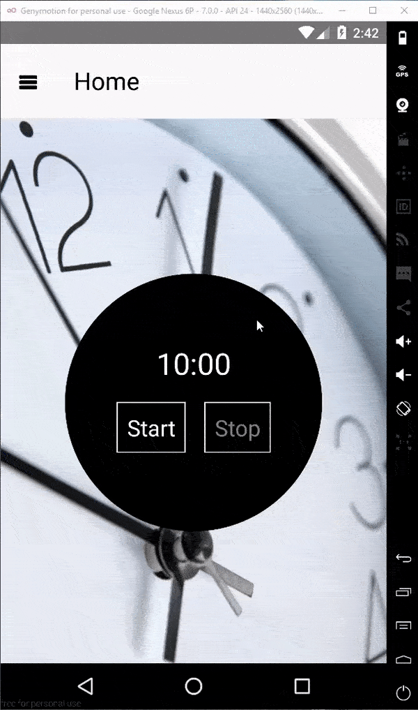

# React-Native-timer-test-app

timer app with 2 screens

###used third-party components:

    "redux" - state container
    "react-redux" - React bindings for Redux.
    "redux-actions" - for creating actions
    "react-navigation" - for navigation

###demo:

